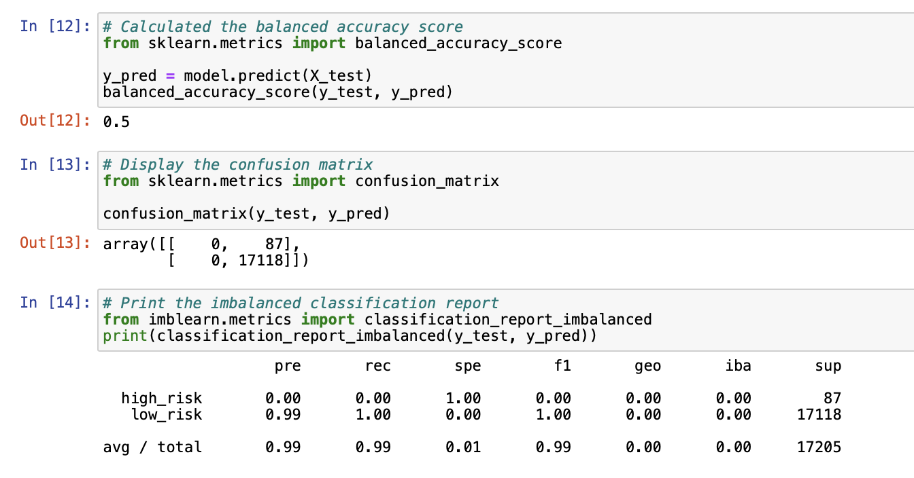
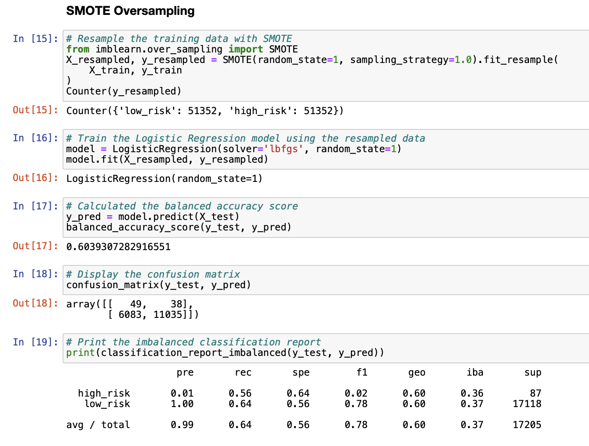
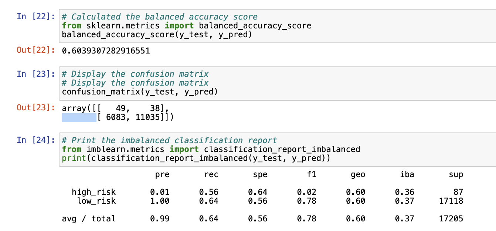
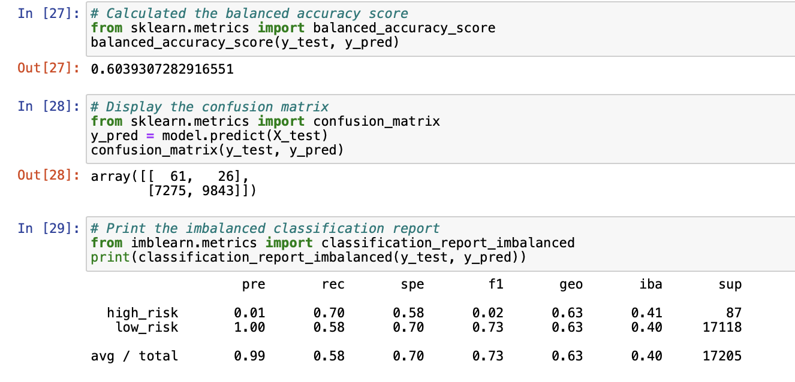
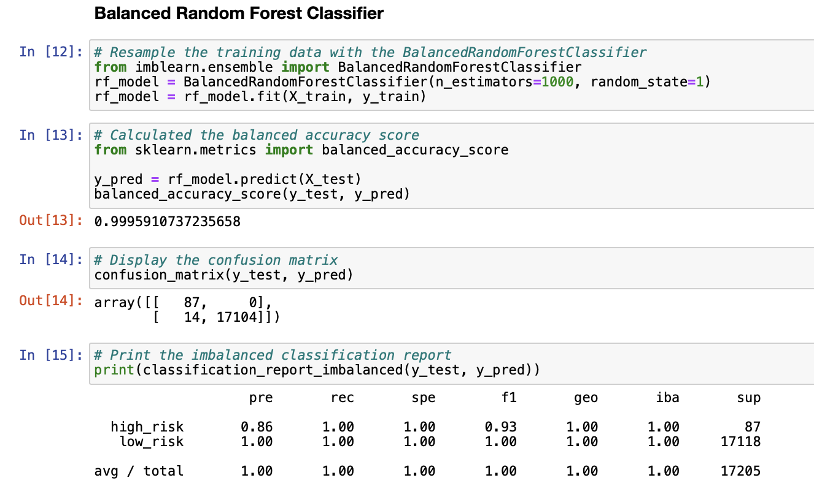
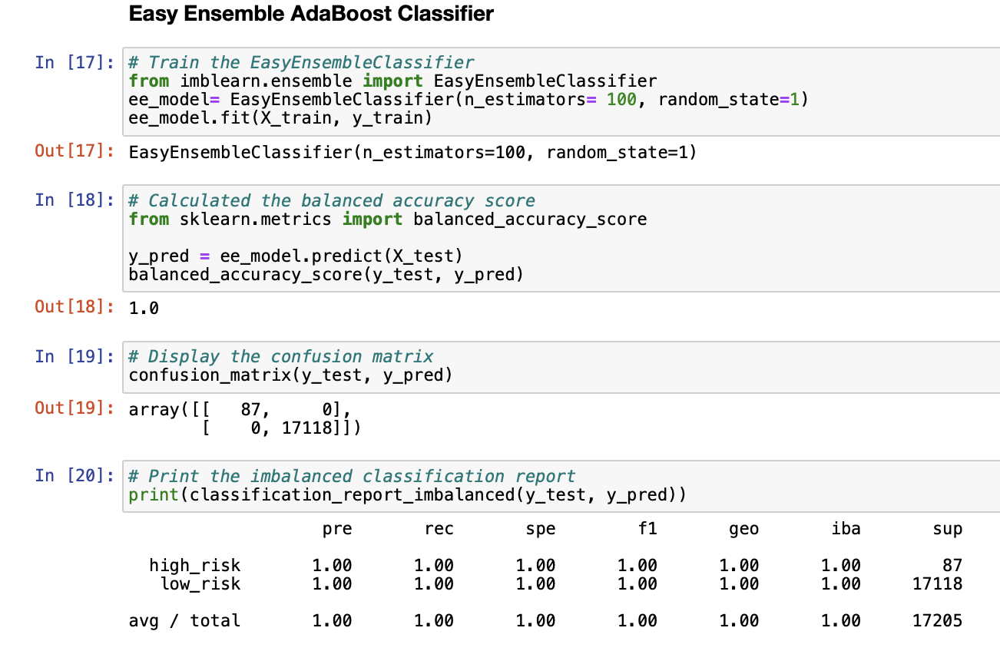

### Credit_Risk_Analysis

The purpose of this analysis was to test and compare different models to predict credit risk.

### Analysis

Oversampling: Accuracy score = .5, Precision = .99, and Recall score = .99. 
 

Smote Oversampling: Accuracy score = .60, Precision = .99, and Recall score = .64. 
 

Undersampling: Accuracy score = .60, Precision = .99, and Recall score = .64. 
 

Combination of over & under sampling: Accuracy score = .60, Precision = .99, and ecall score = .58.
 

Balanced random forest classifier: Accuracy score = .999 , Precision = 1, and Recall score = 1. 
 

Easy ensemble ADABoost Classifier:Accuracy score = 1, Precision = 1, and Recall score = 1. 
 

